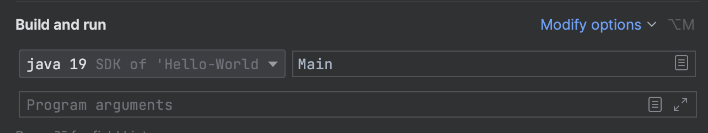

# Hello-World-Extension

To use this Extension download the code and open it within a Java IDE.
<a href="https://github.com/samuelroeben/Hello-World-Extension/archive/refs/heads/main.zip">Download zip file here</a>

Press the green play button to start the code.

If your IDE displays an error, please make shure to use the JAVA SDK 19.

If all worked your output should be like this:

